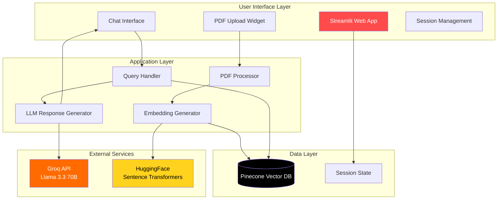
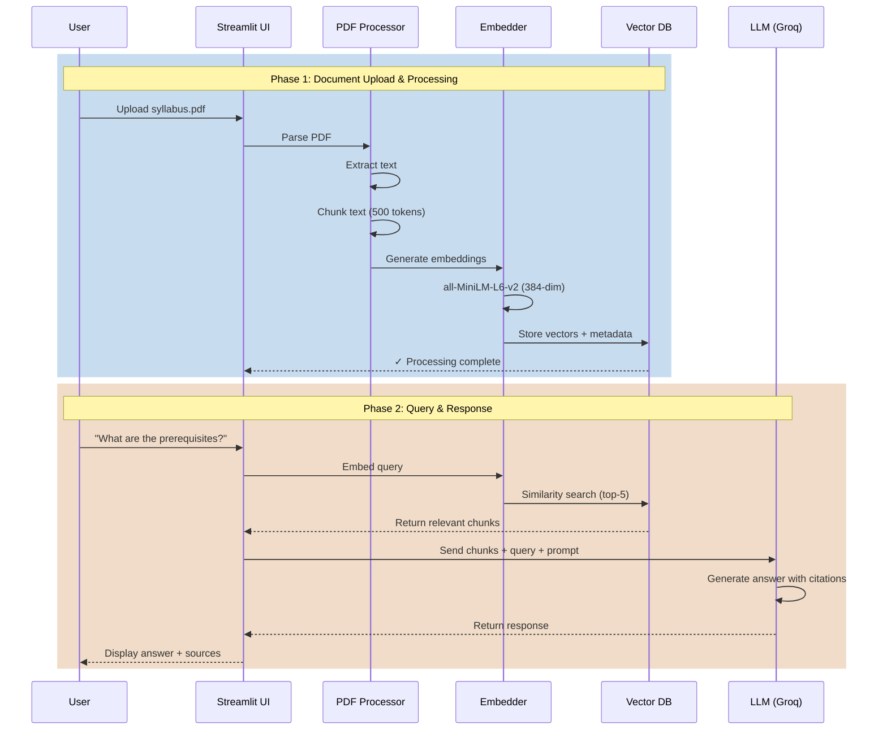
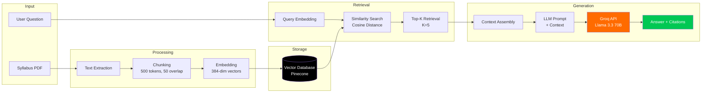
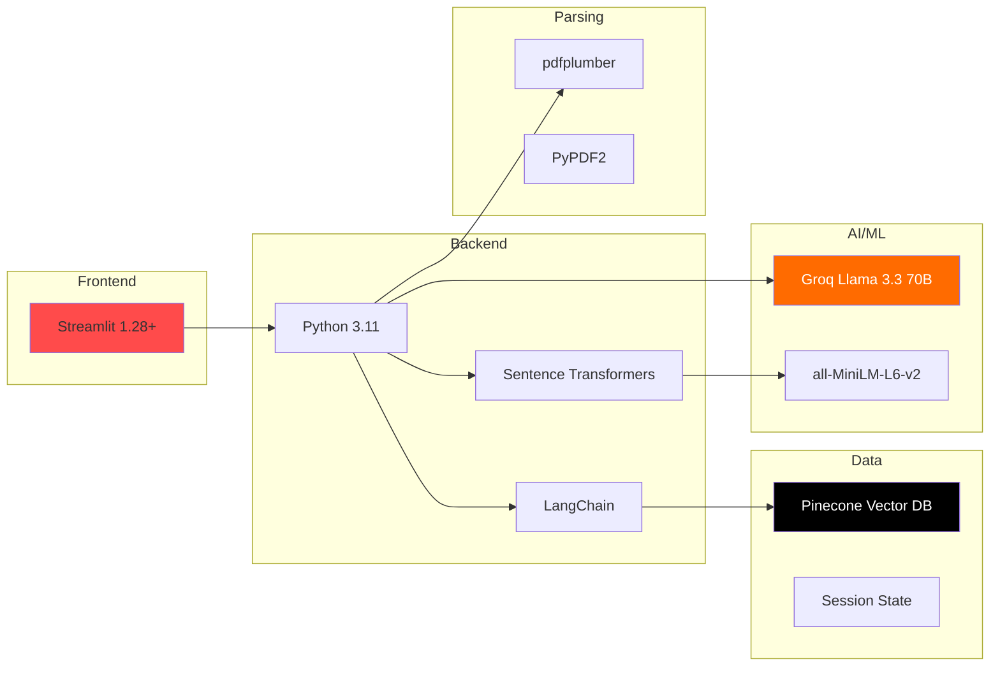

# Talk-to-Syllabus RAG System

**An AI-powered conversational interface that transforms dense course syllabi into interactive Q&A experiences—built entirely on free-tier cloud services.**

[](https://streamlit.io)
[](https://python.org)
[](https://pinecone.io)
[](https://groq.com)

---

## Overview

**Talk-to-Syllabus** is a Retrieval-Augmented Generation (RAG) system that allows students to upload course syllabi in PDF format and ask natural language questions about:

- Course prerequisites and learning outcomes
- Important deadlines and exam schedules
- Required readings and materials

---

## Problem Statement

Build a RAG (Retrieval-Augmented Generation) system where students can upload a Syllabus PDF and ask questions

### Current Challenges Students Face:

| Problem                           | Traditional Solution    | Our Solution                 |
| --------------------------------- | ----------------------- | ---------------------------- |
| **Navigating 20-50 page syllabi** | Manual Ctrl+F search    | AI-powered semantic search   |
| **Finding specific policies**     | Reading entire document | Instant contextual answers   |
| **Understanding prerequisites**   | Scattered information   | Conversational clarification |
| **Remembering deadlines**         | Manual note-taking      | Query-on-demand              |

---

## Key Features

### Core Functionality

- **PDF Upload & Processing**
  - Supports syllabi up to 10MB per file
  - Extracts text from standard PDFs
  - Intelligent chunking for optimal retrieval

- **Conversational Q&A**
  - Natural language understanding
  - Context-aware responses

- **Semantic Search**
  - Goes beyond keyword matching
  - Understands intent and context
  - Retrieves most relevant information

- **Source Transparency**
  - View retrieved context chunks
  - Verify answer accuracy

---

## Technical Architecture

### System Overview



### Data Flow Pipeline



### RAG Pipeline Architecture



---

## Zero-Cost Cloud Usage

### Complete Cost Breakdown

| Service               | Tier        | Monthly Limit            | Monthly Cost | Usage          |
| --------------------- | ----------- | ------------------------ | ------------ | -------------- |
| **Streamlit Cloud**   | Community   | Unlimited apps, 1GB RAM  | **0**        | Hosting        |
| **Pinecone**          | Starter     | 100K vectors, 5M queries | **0**        | Vector storage |
| **Groq**              | Free        | 14,400 requests/day      | **0**        | LLM inference  |
| **HuggingFace**       | Free        | Unlimited inference      | **0**        | Embeddings     |
| **PyPDF2/pdfplumber** | Open Source | N/A                      | **0**        | PDF parsing    |
|                       |             | **TOTAL**                | **0/month**  |                |

## 🛠️ Technology Stack

### Core Technologies



---

### Detailed Stack

| Layer                  | Technology            | Version | Purpose            |
| ---------------------- | --------------------- | ------- | ------------------ |
| **Frontend**           | Streamlit             | 1.28+   | Web interface      |
| **Backend**            | Python                | 3.11    | Core logic         |
| **PDF Parsing**        | pdfplumber            | Latest  | Text extraction    |
| **Text Chunking**      | LangChain             | Latest  | Semantic splitting |
| **Embeddings**         | sentence-transformers | Latest  | Vector generation  |
| **Embedding Model**    | all-MiniLM-L6-v2      | —       | 384-dim embeddings |
| **Vector Database**    | Pinecone              | Latest  | Similarity search  |
| **LLM**                | Groq (Llama 3.3 70B)  | Latest  | Answer generation  |
| **Session Management** | Streamlit State       | Native  | Chat history       |

---

## Installation

### Prerequisites

- Python 3.11 or higher
- pip package manager
- Pinecone account (free tier)
- Groq account (free tier)

### Step 1: Clone Repository

```bash
git clone https://github.com/Kaustubh-790/syllabus_RAG
cd syllabus_RAG
```

### Step 2: Create Virtual Environment

```bash
# Windows
python -m venv venv
venv\Scripts\activate

# macOS/Linux
python3 -m venv venv
source venv/bin/activate
```

### Step 3: Install Dependencies

```bash
pip install -r requirements.txt
```

### Step 4: Configure API Keys

Create `.streamlit/secrets.toml` in the project root:

```toml
PINECONE_API_KEY = "your-pinecone-api-key-here"
GROQ_API_KEY = "your-groq-api-key-here"
```

**Getting API Keys:**

1. **Pinecone:**
   - Sign up at [pinecone.io](https://www.pinecone.io/)
   - Go to API Keys → Create new key
   - Copy the key

2. **Groq:**
   - Sign up at [console.groq.com](https://console.groq.com/)
   - Navigate to API Keys
   - Generate new key

### Step 5: Initialize Pinecone Index

The app automatically creates the index on first run, but you can manually create it:

```python
from pinecone import Pinecone, ServerlessSpec

pc = Pinecone(api_key="your-api-key")
pc.create_index(
    name="course-syllabus",
    dimension=384,
    metric="cosine",
    spec=ServerlessSpec(cloud="aws", region="us-east-1")
)
```

---

## Usage

### Local Development

```bash
streamlit run app.py
```

The app will open in your browser at `http://localhost:8501`

### Using the Application

#### Step 1: Upload Syllabus

1. Click **"Choose a PDF file"** in the sidebar
2. Select your course syllabus (max 10MB)
3. Click **"Process PDF"**
4. Wait for confirmation: "Syllabus processed and stored in Pinecone!"

#### Step 2: Ask Questions

Type your question in the chat input, for example:

- "What are the prerequisites for this course?"
- "When is the final exam?"
- "What's the grading breakdown?"
- "Can I use AI tools for assignments?"

#### Step 3: View Sources

Click **"View Retrieved Context"** below each answer to see the exact syllabus excerpts used.

---

## Project Structure

```
talk-to-syllabus/
│
├── .streamlit/
│   └── secrets.toml          # API keys (not in git)
│
├── app.py                    # Main Streamlit application
├── pdf_processor.py          # PDF parsing & chunking
├── vector_store.py           # Pinecone integration
├── llm_handler.py            # Groq API wrapper
├── prompts.py                # RAG system prompts
│
├── requirements.txt          # Python dependencies
├── .gitignore               # Git ignore rules
├── README.md                # This file
│
└── __pycache__/             # Python cache (ignored)
```

---
